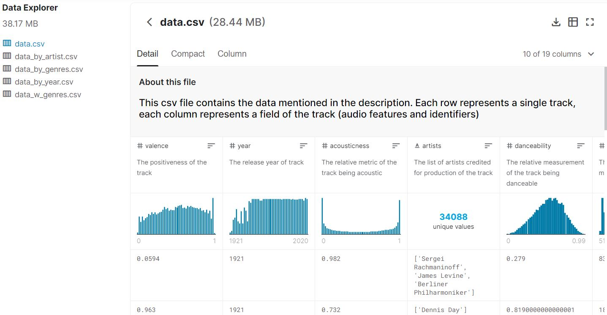

Our topic relates to Spotify musical-track data ranging from 1921 to 2020 regarding several variables. Our final project will allow the user to filter by track to pull up the attributes found in the related CSV files. There will also be a visualization that shows the prevalence of various song attributes over time. Our bar graph will compare the average popularity of genres. Filter top 5 artists by selected attributes. 

### Why?

Because who doesn't like music? And Spotify is one the leading apps for listening to music. We want to examine what is popular, what makes it popular, and how music has changed over the past 100 years. For us, the experience we value is in creating a filtered dashboard (a valued skill in data science)
.
DATASET: https://www.kaggle.com/yamaerenay/spotify-dataset-19212020-160k-tracks
 	
* 160,000+ songs with 19 data points each

* Grouped by artists, genre or year

## Metadata

## Examples

### Line Graph

### Dashboard

### Bar Charts

## Projected Visualization

Link to GitHub: https://github.com/AllCAPs788/project_2-b.git